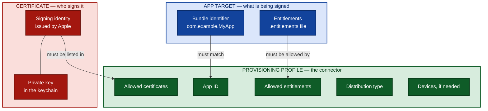
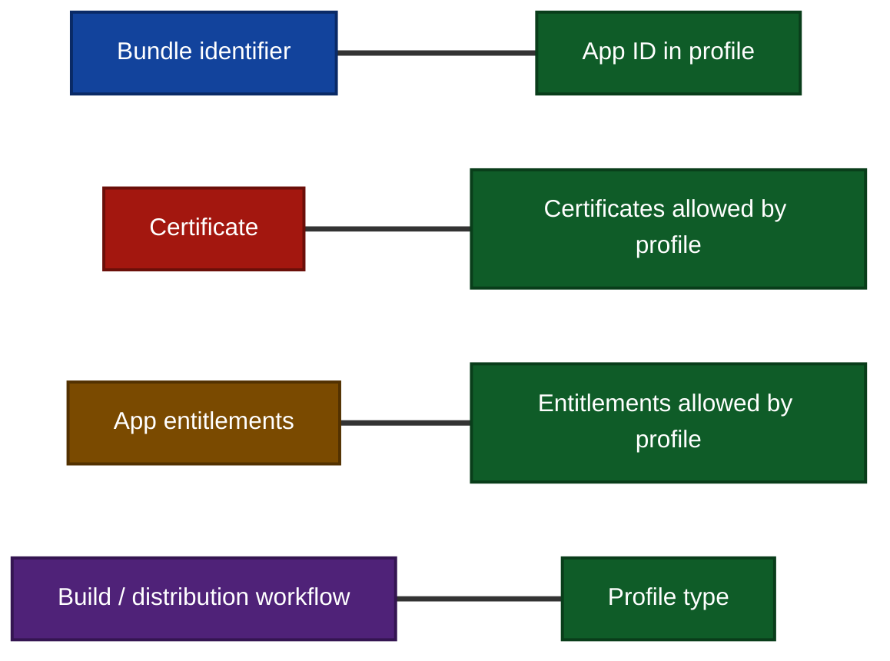
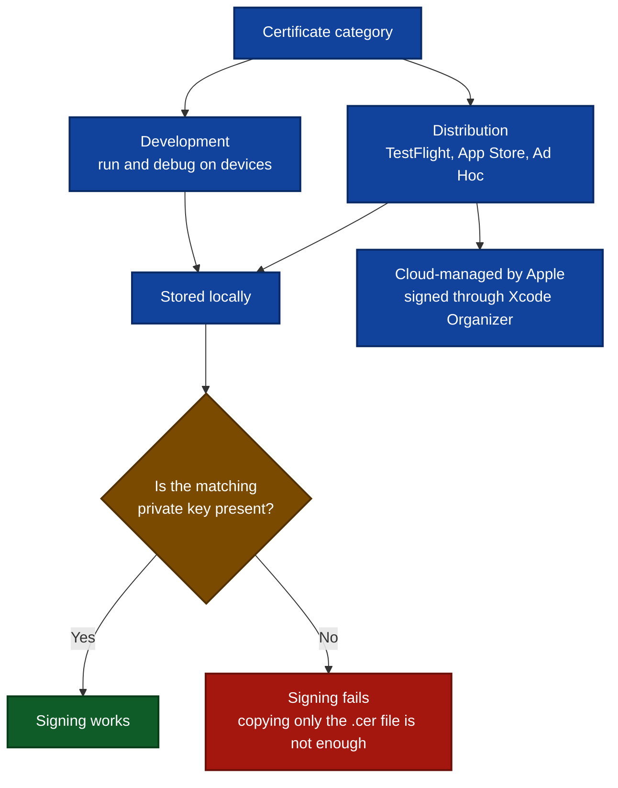
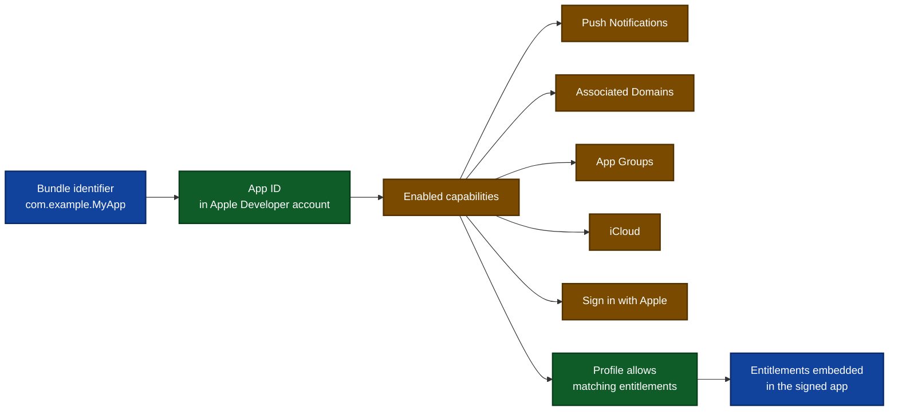
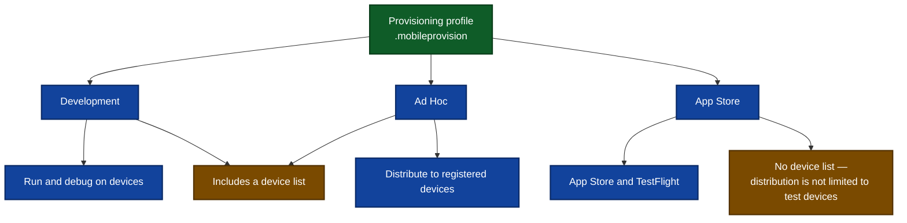
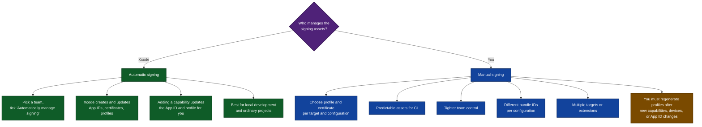
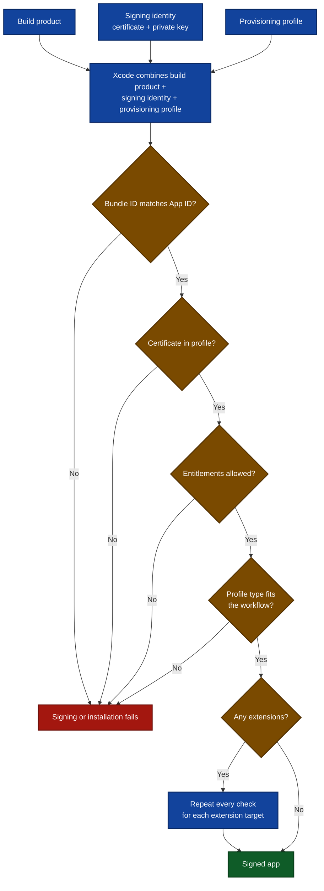
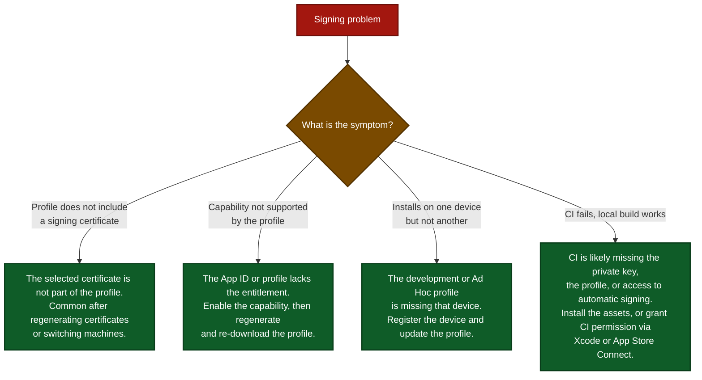

# A Visual Guide to iOS Code Signing & Provisioning

Code signing answers **who made this app**. Provisioning answers **what it may do and where it may run**.

---

## 1. The mental model

Three pieces, one job each. The profile is the glue.

> If any one of these is out of sync, Xcode cannot sign the app or iOS refuses to install it.

---

## 2. The four things that must match

Every **extension target** repeats this whole checklist with its own bundle identifier, App ID, and profile.

---

## 3. Certificates and where the private key lives

---

## 4. App IDs and capabilities

The App ID is where capabilities get switched on in the developer account — and the profile only allows the entitlements the App ID supports.

---

## 5. Profile types

---

## 6. Automatic vs. manual signing

---

## 7. What happens at signing time

---

## 8. Troubleshooting decision tree

---

## Summary in one line each

| Piece | Question it answers |
| --- | --- |
| Certificate | Who signs the app |
| App ID | Which app this is |
| Entitlements | What the app wants to do |
| Provisioning profile | Which combinations are allowed, and where the app can run |

**Automatic signing** hands most of this to Xcode. **Manual signing** gives more control, at the cost of keeping certificates, profiles, entitlements, bundle identifiers, and devices in sync yourself.

---

> **Source:** These diagrams are based on the article *Understanding code signing and provisioning in iOS* by tanaschita.com — <https://tanaschita.com/ios-code-signing-provisioning/?utm_source=substack&utm_medium=email>
