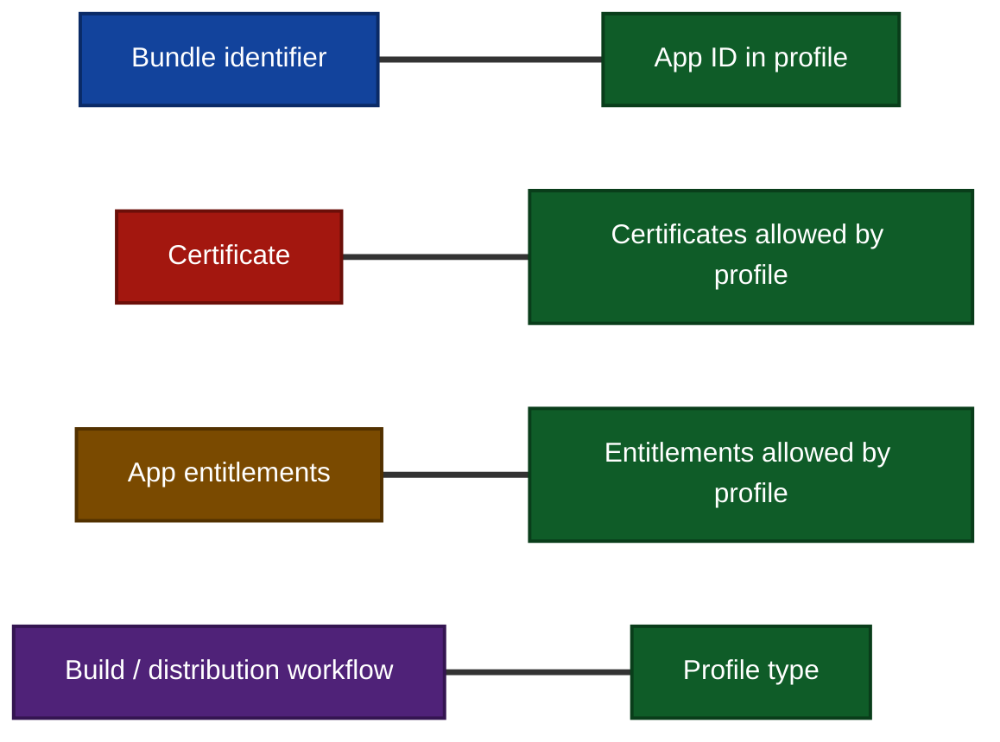
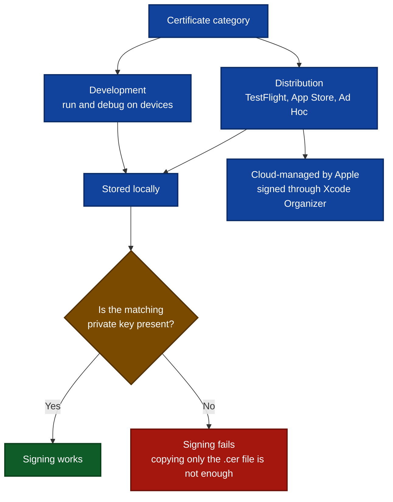
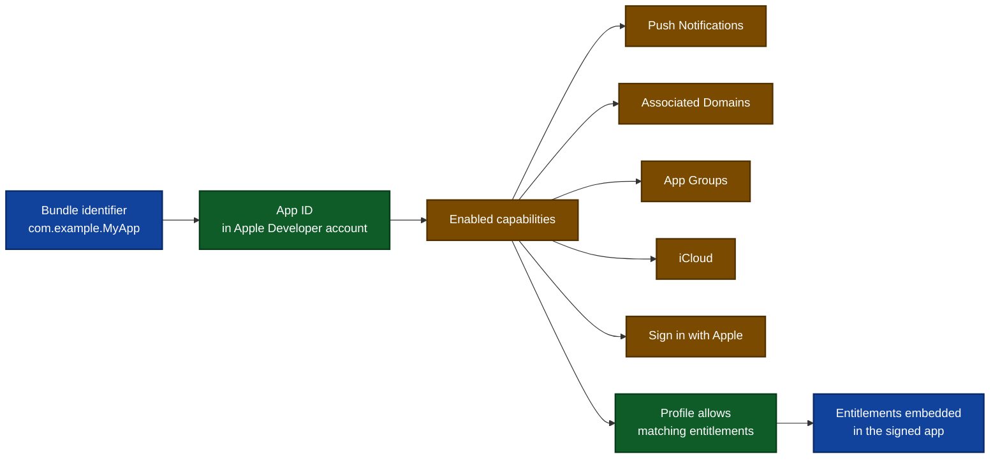
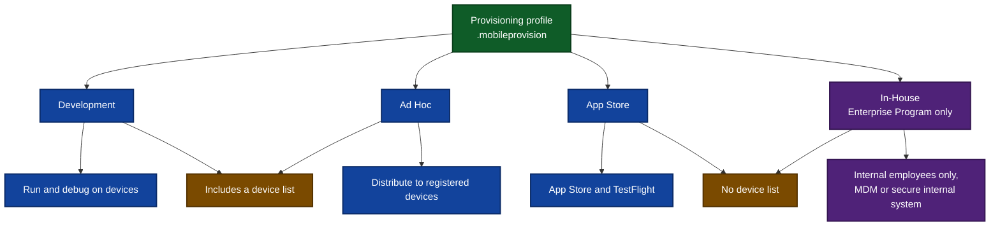
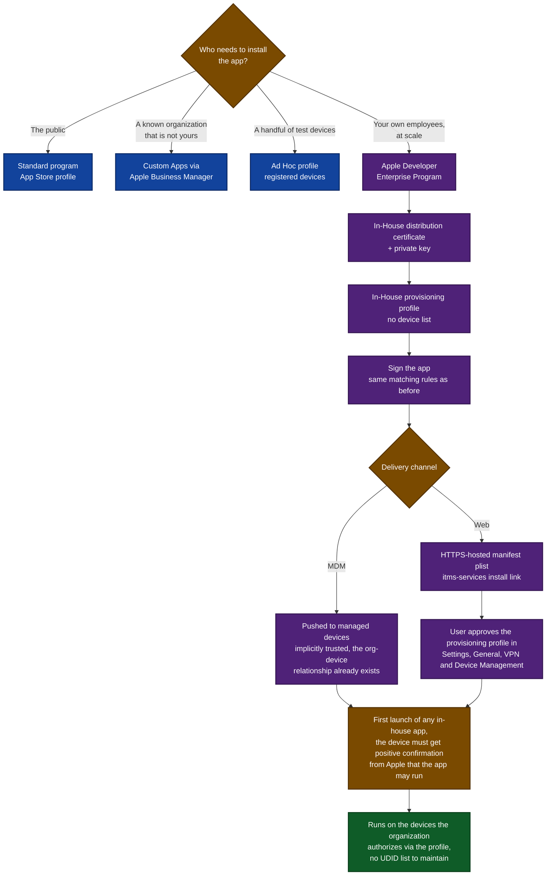
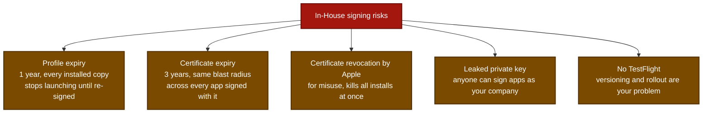
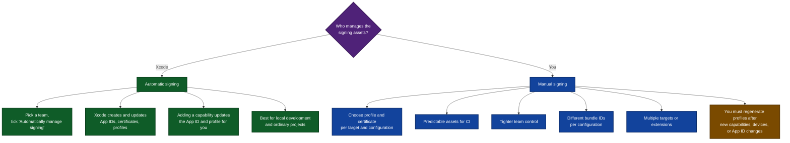
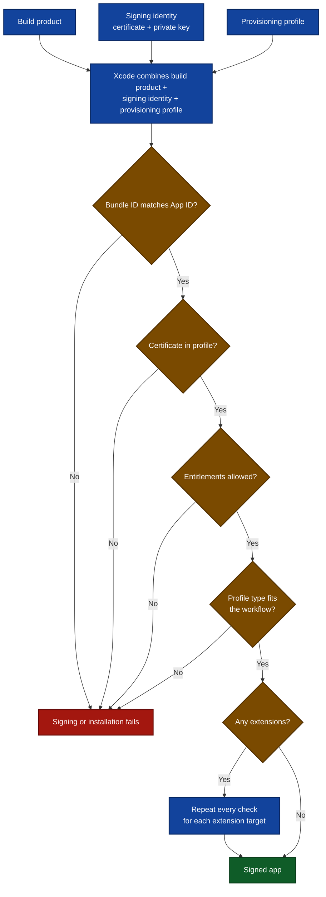
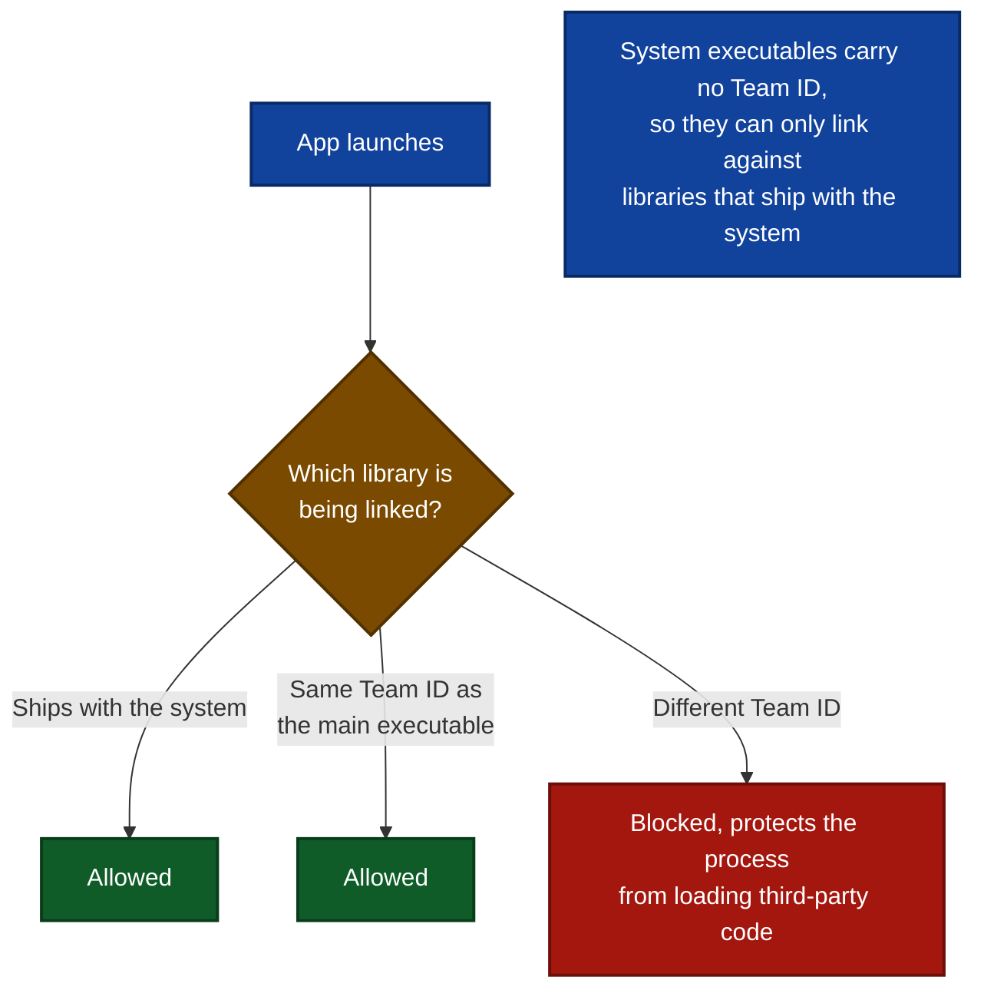
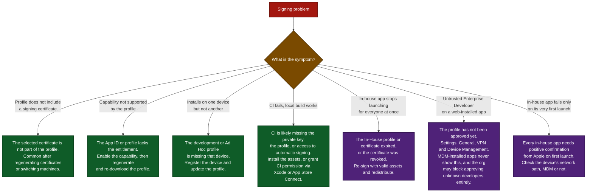

# A Visual Guide to iOS Code Signing & Provisioning

Code signing answers **who made this app**. Provisioning answers **what it may do and where it may run**.

---

## 1. The mental model

Three pieces, one job each. The profile is the glue.

> If any one of these is out of sync, Xcode cannot sign the app or iOS refuses to install it.

---

## 2. The four things that must match

Every **extension target** repeats this whole checklist with its own bundle identifier, App ID, and profile.

---

## 3. Certificates and where the private key lives

---

## 4. App IDs and capabilities

The App ID is where capabilities get switched on in the developer account. The profile only allows the entitlements the App ID supports.

---

## 5. Profile types

---

## 6. Enterprise (In-House) signing

Enterprise signing is the same three-piece model, with one difference that changes everything downstream. **The profile has no device list and no App Store review**, so a signed build installs on any device that trusts the organization.

That power is why Apple gates it behind a separate program. The Apple Developer Enterprise Program costs $299/year, the organization must be a legal entity with 100 or more employees (no DBAs, trade names, or branches), and the apps must be proprietary, internal-use apps distributed only to employees. It is explicitly meant for cases the App Store, Apple Business Manager custom apps, Ad Hoc, and TestFlight cannot cover.

Two details are easy to get backwards. The Settings approval is **not** universal, since MDM-installed apps skip it because the organization-device relationship is already established. The Apple confirmation on first launch **is** universal, MDM or not, which means an in-house app needs a working network path on its very first run. Organizations can also block users from approving apps from unknown developers entirely, leaving MDM as the only viable channel.

### What changes compared to App Store signing

| | App Store | Ad Hoc | In-House (Enterprise) |
| --- | --- | --- | --- |
| Program | Apple Developer, $99/yr | Apple Developer, $99/yr | Apple Developer Enterprise, $299/yr |
| Audience | Anyone | Registered test devices | Own employees only |
| Device list in profile | No | Yes | No |
| App Review | Yes | No | No |
| Delivery | App Store / TestFlight | Ad Hoc install | MDM or hosted manifest |
| Extra user step | None | None | Approve the profile in Settings, unless installed via MDM |
| First-launch network check | No | No | Yes, always |

### The failure modes that are unique to Enterprise

The practical consequence is simple. Treat the In-House certificate and private key like production secrets, keep the renewal dates on a calendar, and plan a re-sign-and-redistribute path before you need it.

> The expiry windows and revocation behaviour above are operational experience rather than quotes from Apple's security documentation. Confirm the current validity periods in your own developer account before building a renewal schedule on them.

---

## 7. Automatic vs. manual signing

Enterprise builds are usually signed manually, or with an explicitly pinned profile in CI, because the release depends on one specific In-House identity rather than whatever Xcode would pick.

---

## 8. What happens at signing time

### What the system checks at launch

Signing correctly is only half the story. iOS requires that all executable code be signed with an Apple-issued certificate, and at launch it validates the code signature of every dynamic library the process links against, so the app's own frameworks and its extensions are checked too, not just the main binary.

The mechanism is the **Team ID**, a 10-character alphanumeric string, for example `1A2B3C4D5F`, extracted from the Apple-issued certificate.

This is why every embedded framework and extension has to come out of the same signing setup. A mismatch here fails at launch on the device, long after the build succeeded.

---

## 9. Troubleshooting decision tree

---

## Summary in one line each

| Piece | Question it answers |
| --- | --- |
| Certificate | Who signs the app |
| App ID | Which app this is |
| Entitlements | What the app wants to do |
| Provisioning profile | Which combinations are allowed, and where the app can run |

**Automatic signing** hands most of this to Xcode. **Manual signing** gives more control, at the cost of keeping certificates, profiles, entitlements, bundle identifiers, and devices in sync yourself. **Enterprise signing** is manual signing with a much larger blast radius when something expires.

---

> **Source.** These diagrams are based on the article *Understanding code signing and provisioning in iOS* by tanaschita.com.
> <https://tanaschita.com/ios-code-signing-provisioning>
>
> She did an excellent job of explaining how signing works but I wanted to make a visual representation of it.
> She also has two great iOS books that I highly recommend, <https://tanaschita.com/books/>
>
> The Enterprise (In-House) section and the launch-time validation notes are not from the article. Details on the Apple Developer Enterprise Program come from Apple's program page, <https://developer.apple.com/programs/enterprise/>
>
> Mandatory code signing, Team ID library validation, and in-house app verification follow Apple Platform Security, "App code signing process in iOS, iPadOS, tvOS, visionOS, and watchOS."
